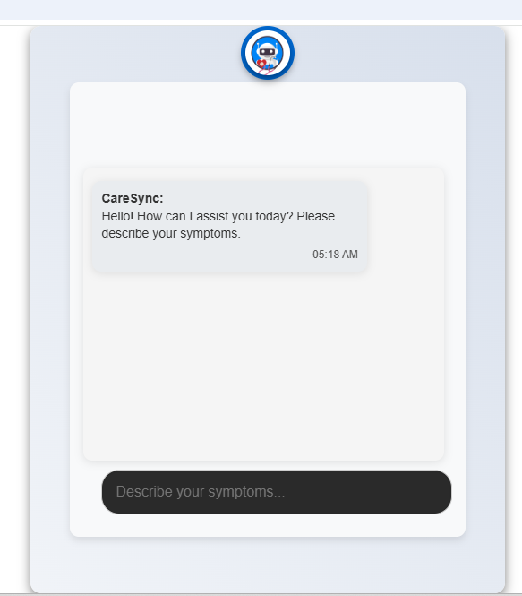
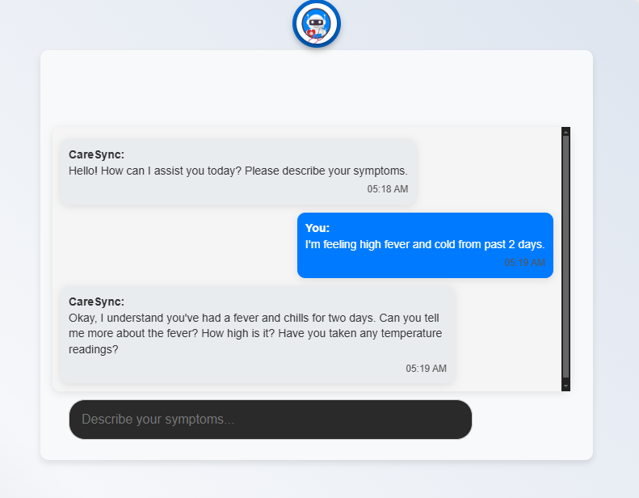
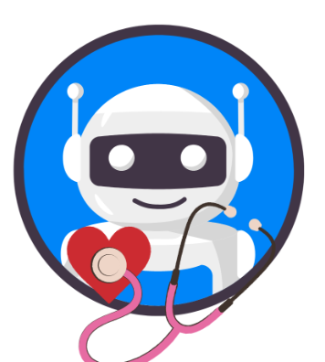

# Getting Started with Create React App - AI_Doctor
<u></u>
AI Co Doctor that helps with health related stuff and provide answer according to symptoms

In the project directory, you can run:

npm start

Runs the app in the development mode.

Open http://localhost:3000 to view it in your browser.

The page will reload when you make changes.

## SneaKPeak :

